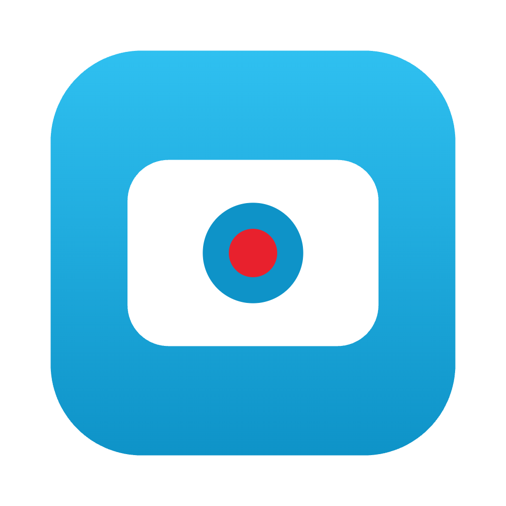

# MyScreen

A free, open-source screen recorder for macOS in the spirit of Loom: record your screen with an optional camera bubble, get an MP4 saved locally, and (if you want) a share link uploaded to your own Dropbox. No accounts, no subscriptions, your recordings never touch anyone else's server.



## Download

Grab the latest DMG from [Releases](../../releases/latest), open it, and drag MyScreen to Applications.

The app is signed and notarized. On first launch, macOS requires a one-time manual step to allow screen recording (Apple removed the automatic prompt in recent macOS versions); the app walks you through it.

## Features

- **Full screen, window, or camera-only recording** with a live preview
- **Camera overlay**: draggable, resizable bubble (rounded or circle, mirrored or not) composited into the recording exactly as previewed
- **Pause and resume** (paused time excluded from the recording)
- **Auto-save**: recordings land in `~/Movies/MyScreen` (configurable) as MP4 or WebM, no save dialogs
- **Share links via your own Dropbox**: connect once, and every saved recording uploads to your Dropbox with a view link copied to your clipboard
- **Crash recovery**: recordings stream to disk while recording; if the app dies mid-take, it offers the recovered video on next launch
- **Quality presets** and optional hardware encoding

## Privacy

Recordings are written to your local disk. The optional share feature uploads to *your* Dropbox account via OAuth (the app folder `Apps/MyScreen Recorder/` is the only thing it can access). There is no telemetry, no backend, no account.

## Development

Vanilla JavaScript, no build step: UI files load directly via script tags (React 18 UMD, vendored). The recording engine is DOM-free and unit-tested with fakes.

```bash
npm install        # also compiles the native screen-permission addon
npm start          # run the app
npm test           # engine + writer tests (node:test, no permissions needed)
npm run dist       # build a signed DMG (requires Apple Developer credentials)
```

Architecture notes, testing recipes, and macOS permission gotchas live in [CLAUDE.md](CLAUDE.md) and [docs/TESTING.md](docs/TESTING.md).

## License

[GPL-3.0](LICENSE). Fork it, improve it, ship it. Derivatives must stay open source.
